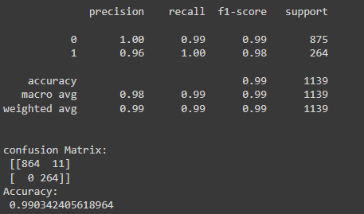
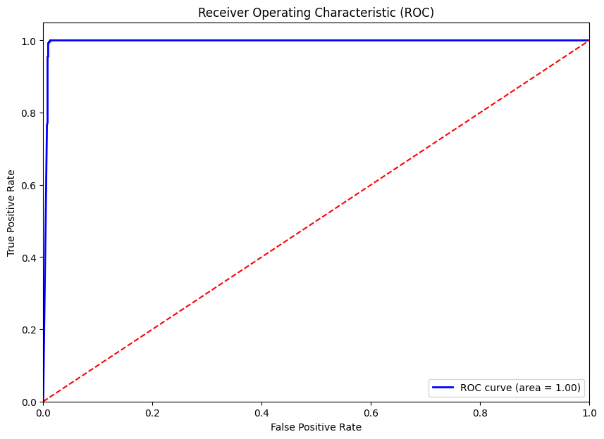

# Email Spam Detection

This project demonstrates a complete workflow for detecting spam emails using a Naive Bayes classifier.

## Overview

The goal of this project is to classify emails as spam or not spam based on their content. The project uses a Naive Bayes classifier for the classification task.

## Dataset

The dataset used in this project contains email data with two columns:
- `text`: The content of the email.
- `spam`: A binary label indicating whether the email is spam (1) or not spam (0).

## Model Description

The model used in this project is a Naive Bayes classifier, which is particularly effective for text classification tasks.

1. **Data Preprocessing**:
   - **Text Cleaning**: The text data is cleaned by removing punctuation and stopwords using NLTK's stopwords list.
   - **Vectorization**: The cleaned text is converted into a matrix of token counts using `CountVectorizer`.

2. **Naive Bayes Classifier**:
   - **Purpose**: The Naive Bayes classifier is used to predict whether an email is spam or not based on the token counts.
   - **Training**: The classifier is trained on 80% of the dataset and tested on the remaining 20%.

## Data Visualization

### Confusion Matrix

### Accuracy

### ROC Curve

